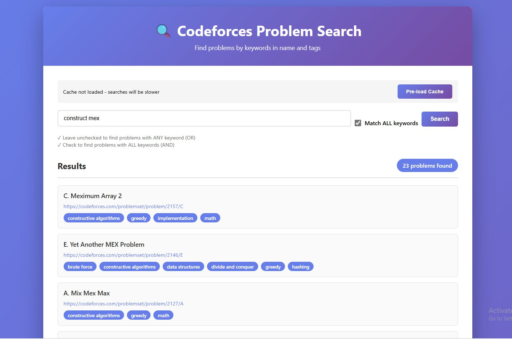

# Codeforces Problem Search 🔍

A beautiful web application to search for **Codeforces problems** by keywords in problem names and tags. Find construction problems, dynamic programming challenges, and more in seconds!

## Features ✨

- 🔍 **Powerful Search** - Find problems by keywords
- ✓ **Flexible Matching** - Match ANY (OR) or ALL (AND) keywords
- 💾 **Smart Caching** - Pre-load problems for instant searches
- 🎨 **Beautiful UI** - Modern, responsive web interface
- ⚡ **Fast API** - Direct Codeforces API integration
- 📱 **Mobile-Friendly** - Works great on all devices

## Screenshots



## Quick Start 🚀

### Prerequisites

- **Python 3.8+**
- **pip** (Python package manager)
- **Git** (optional, for cloning)

### Installation & Setup (5 minutes)

**Step 1: Clone the repository**

```bash
git clone https://github.com/profadham/codeforces-problem-search.git
cd codeforces-problem-search
```

**Step 2: Create a virtual environment (recommended)**

```bash
# Windows
python -m venv venv
venv\Scripts\activate

# macOS/Linux
python3 -m venv venv
source venv/bin/activate
```

**Step 3: Install dependencies**

```bash
pip install -r requirements.txt
```

**Step 4: Run the application**

```bash
python app.py
```

**Step 5: Open in your browser**

Navigate to: `http://localhost:5000`

That's it! Your app is running! 🎉

## How to Use 📖

1. **Enter Keywords** - Type keywords separated by spaces
   - Example: `construct` or `construct permutation`

2. **Choose Match Mode**
   - ☐ **Unchecked (ANY)** - Find problems with ANY keyword
   - ☑ **Checked (ALL)** - Find problems with ALL keywords

3. **Click Search** - Or press Enter

4. **Browse Results** - Click any problem to open on Codeforces

5. **Pre-load Cache** (First Time Only)
   - Click "Pre-load Cache" to load all 10,000+ problems
   - Subsequent searches will be instant!

### Example Searches

```
"construct"           → All construction problems
"dp dynamic"          → Dynamic programming problems  
"graph tree"          → Graph and tree problems
"construct array"     → Construction + array problems (ALL mode)
```

## File Structure 📁

```
codeforces-problem-search/
│
├── app.py                      # Flask backend application
├── config.py                   # Configuration settings
├── requirements.txt            # Python dependencies
├── Procfile                    # Production deployment config
│
├── templates/
│   └── index.html             # Web UI (HTML/CSS/JavaScript)
│
├── README.md                  # This file
├── .gitignore                 # Git configuration
└── .git/                      # Git repository
```

## Project Structure

### Backend (`app.py`)
- Flask web server
- API endpoints for search and caching
- Integration with Codeforces API
- Smart problem filtering

### Frontend (`templates/index.html`)
- Modern, responsive web UI
- Real-time search with loading indicators
- Problem result cards with tags
- Cache status display

## API Reference 🔌

### POST `/api/search`

Search for problems by keywords

**Request:**

```json
{
  "keywords": "construct permutation",
  "match_all": false
}
```

**Response:**

```json
{
  "status": "success",
  "count": 100,
  "results": [
    {
      "link": "https://codeforces.com/problemset/problem/2000/A",
      "name": "Problem Title",
      "tags": ["constructive algorithms", "greedy"],
      "contestId": 2000,
      "index": "A"
    }
  ]
}
```

### POST `/api/load-cache`

Pre-load all Codeforces problems into memory for instant searches

**Response:**

```json
{
  "status": "loading",
  "message": "Loading problems in background"
}
```

### GET `/api/cache-status`

Check if problems are cached and get total count

**Response:**

```json
{
  "cached": true,
  "count": 10867
}
```

## Technologies Used 🛠️

- **Backend**: Flask (Python)
- **Frontend**: HTML5, CSS3, JavaScript
- **API**: Codeforces API
- **Data Source**: 10,000+ Codeforces problems
- **Server**: Python built-in server (dev), Gunicorn (production)

## Troubleshooting 🔧

### "ModuleNotFoundError: No module named 'flask'"

Make sure you've installed dependencies:
```bash
pip install -r requirements.txt
```

### "Address already in use" on port 5000

Another app is using port 5000. Either:
1. Close the other application, or
2. Edit `app.py` and change `port=5000` to another port

### Search is slow on first try

Click "Pre-load Cache" to cache all problems - subsequent searches will be instant!

### "Connection error" when searching

Make sure you have internet connection. The app needs to reach Codeforces API on first search.

## Development 👨‍💻

### Running in Debug Mode

The app runs in debug mode by default. To disable:

Edit `app.py` and change:
```python
if __name__ == '__main__':
    app.run(debug=False, port=5000)  # Change debug=True to False
```

### Modifying Search Logic

Edit the `/api/search` endpoint in `app.py` to customize how problems are filtered and matched.

### Styling Changes

Modify `templates/index.html` to change the UI, colors, or layout.

## Performance Notes ⚡

- **First search**: ~2 seconds (fetches from Codeforces API)
- **Cached search**: <100ms (searches in-memory cache)
- **Cache size**: ~1 MB in memory
- **Total problems indexed**: 10,000+

## Deployment 🚀

Want to host online? See [DEPLOYMENT.md](DEPLOYMENT.md) for options:
- PythonAnywhere (easiest, free tier)
- Render (modern, free)
- Railway (very simple)
- Heroku (classic, paid only now)

## Contributing 🤝

Contributions welcome! Feel free to:
- Report bugs
- Suggest features
- Submit pull requests
- Improve documentation

## License 📄

MIT License - Feel free to use this project for anything!

## Author ✍️

Created by **profadham**

## Questions? 💬

Check the documentation files:
- `README.md` - This file (setup & usage)
- `DEPLOYMENT.md` - How to deploy online
- `app.py` - Code comments and structure

---

**Happy problem hunting! 🚀**

If this project helped you find problems to practice, please star it on GitHub! ⭐

